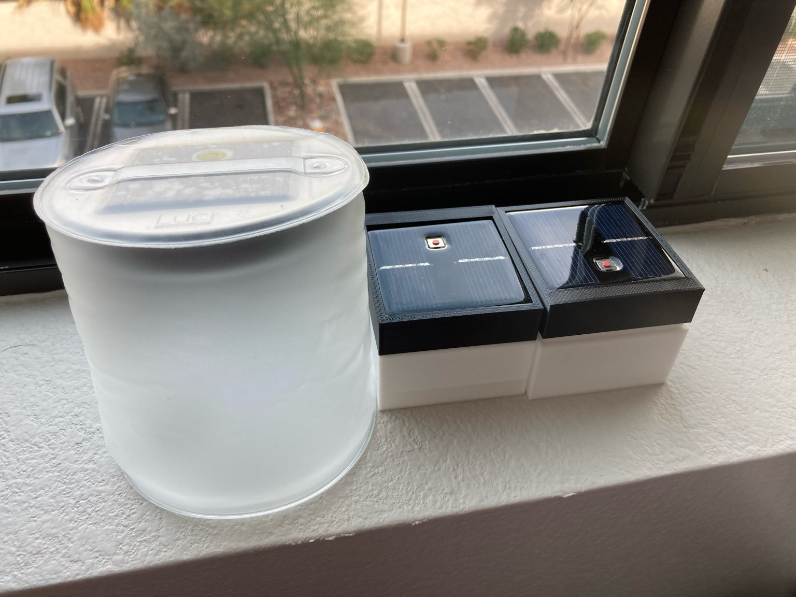
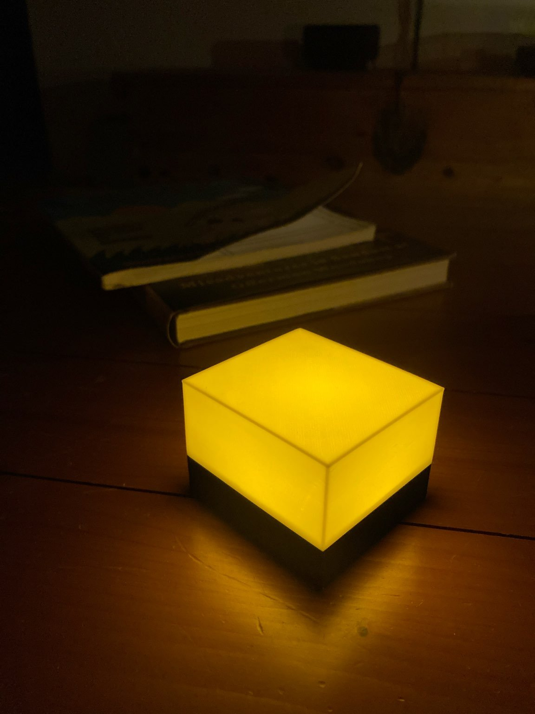

# luci-candle-remix
3D printed enclosure to repackage the Luci Candle solar-powered light for a more domestic setting.

## Description

> Original on the left next to two fitment test prints on the right.

The goal of this project was to design a new enclosure for the electrical components of the Luci Candle.  While the original lamp with it's bouyant, waterproof design is great for use in the outdoors, it looks a bit out of place in a more domestic environment.  Add to that the fact that the lamp is essentially disposable as there is no way to access the internal lithium-ion battery, and the new housing provides a new lease on life for Luci Candle power units that have had their batteries replaced.

While it could still benefit from a few tweaks here and there, the end result looks much more at home indoors.  With its solar panel facing downwards there's almost no indication of the new lamp's green functionality.

## Cura Print Settings

**Creality Ender 3 V2**
- 0.4mm brass extruder nozzle
- 0.2mm layer height
- 0% infill
- No supports
- No extra adhesion

The finished result has a bit of flex to it, but once assembled it becomes a bit more sturdy.  There will be a bit of non-function-affecting stringiness that needs to be trimmed away.  At that point the power unit from the Luci Candle can be fit into the lid, hot glued into place, and then the lid can be popped onto the bottom box with a bit of pressure.